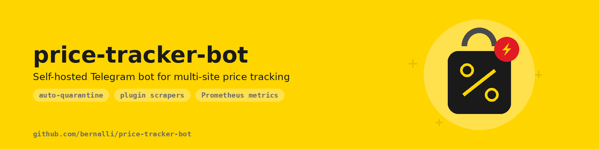
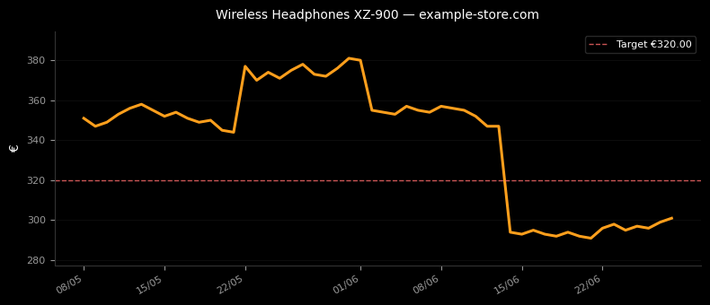

<p align="center">
  
</p>

# price-tracker-bot

[](https://github.com/bernalli/price-tracker-bot/actions/workflows/ci.yml)
[](https://github.com/bernalli/price-tracker-bot/actions/workflows/security.yml)
[](LICENSE)
[](https://www.python.org/downloads/)
[](https://github.com/bernalli/price-tracker-bot/releases)

Self-hosted Telegram bot for multi-site price tracking with auto-quarantine, structured observability, fine-grained notification preferences, and a plugin architecture for adding new sites.

<p align="center">
  
  <br>
  <em>The <code>/chart</code> command: price history with your target line, rendered by the bot.</em>
</p>

## Why this bot

| Feature                          | price-tracker-bot | Camelcamelcamel | Keepa | Pricepulse |
| -------------------------------- | ----------------- | --------------- | ----- | ---------- |
| Self-host                        | ✅                 | ❌               | ❌     | ❌          |
| Multi-site (17 built-in)         | ✅                 | ❌ (Amazon only) | ❌     | partial    |
| Plugin extension point           | ✅                 | ❌               | ❌     | ❌          |
| Full observability (Prom+Grafana)| ✅                 | ❌               | ❌     | ❌          |
| Fine-grained notifications       | ✅                 | basic           | basic | basic      |
| Open-source (MIT)                | ✅                 | ❌               | ❌     | ❌          |

## Key features

- 17 built-in scrapers (Amazon, eBay, Shopify-generic, Walmart, Target, BestBuy, Etsy, Newegg, Wayfair, MediaMarkt, Otto, Zalando, Apple Store, Google Store, AliExpress, Generic JSON-LD/microdata/OG/RDFa chain, Playwright fallback)
- Per-domain auto-quarantine with tier-based exponential backoff (closes infinite-429 loops)
- Multi-currency price tracking (Decimal precision, ECB rates with persistent TTL cache)
- Outlier detection via median ratio (rejects bogus parses without polluting price history)
- Notification preferences: mute, digest, quiet hours, throttle, timezone-aware, per-product
- Prometheus exporter on `127.0.0.1:9090` + structured JSON logging via structlog
- Grafana dashboard with 14 panels (latency, block rate, quarantine map, alerts, currency)
- Plugin extension point at `plugins/` for custom scrapers
- Trilingual UI (English + Italian + Spanish) with auto-detect from Telegram `language_code`
- Hardened Docker deploy: non-root, read-only root fs, dropped capabilities, no-new-privileges, resource limits

## Quick start

```bash
git clone https://github.com/bernalli/price-tracker-bot.git
cd price-tracker-bot
cp .env.example .env
# edit .env: set TELEGRAM_BOT_TOKEN and ALLOWED_USERS
docker compose up -d
docker compose logs -f price-tracker-bot
```

Send `/start` to your bot from Telegram. The first user listed in `ALLOWED_USERS` is auto-promoted to admin.

## Configuration

All configuration is via environment variables. Copy `.env.example` to `.env` and fill in:

| Variable                | Default                  | Description                                                                      |
| ----------------------- | ------------------------ | -------------------------------------------------------------------------------- |
| `TELEGRAM_BOT_TOKEN`    | (required)               | Telegram bot API token                                                           |
| `ALLOWED_USERS`         | (required)               | Comma-separated Telegram user IDs authorized to use the bot (first listed becomes admin) |
| `DATABASE_PATH`         | `/data/pricetracker.db`  | SQLite database path                                                             |
| `LOCALE`                | `en`                     | Default locale fallback when the Telegram `language_code` is missing             |
| `CHECK_INTERVAL_MINUTES`| `360`                    | Global sweep interval                                                            |
| `MAX_CONSECUTIVE_ERRORS`| `10`                     | Failed checks before a product is auto-suspended                                 |
| `LISTING_GONE_CONFIRMATIONS` | `3`                  | Consecutive HTTP 404/410 answers before a removed listing is suspended           |
| `READ_CONFIRMATIONS`    | `3`                      | Agreeing checks required before an implausible price raises an alert             |
| `PROMETHEUS_BIND`       | `127.0.0.1:9090`         | Prometheus exporter bind address (host:port)                                     |
| `LOG_LEVEL`             | `INFO`                   | structlog log level                                                              |

See [docs/operations.md](docs/operations.md) for full operational reference.

## Commands

Every command has an English name and, where it existed first, an Italian alias — both
are registered, so `/list` and `/lista` are the same command.

### Tracking
- `/start` — register and view the main menu
- `/menu` — open the inline menu
- `/help` — command reference
- `/add <url>` (`/aggiungi`) — start tracking a product
- `/list` (`/lista`) — tracked products with current price, drop since tracking start, and per-product buttons
- `/delete <id>` (`/elimina`) — stop tracking
- `/check <id>` (`/controlla`) — check one product now
- `/checkall` — check every product now
- `/pause <id>` (`/pausa`) / `/reactivate <id>` (`/riattiva`) — suspend and resume checks
- `/history <id>` (`/storia`) — price history chart
- `/reset <id>` (`/azzera`) — rebase the reference price to the current one

### Thresholds and targets
- `/threshold <id> <pct|off>` (`/soglia`) — percentage alert threshold
- `/target <id> <price>` — alert when the price reaches this value
- `/setinterval <id> <minutes>` (`/intervallo`) — per-product check interval
- `/refresh` — global check interval

### Notification preferences (per user)
- `/mute <id|all> [duration]` / `/unmute <id|all>` — silence alerts
- `/digest_mode <on|off>` — batch alerts into a periodic digest
- `/digest_now` — flush the pending digest immediately
- `/quiet_hours <HH:MM-HH:MM>` — silent window (timezone-aware)
- `/timezone <IANA>` — your timezone (e.g. `Europe/Rome`)
- `/throttle <max_per_hour>` — sliding-window rate limit
- `/prefs` — current preferences

### Data
- `/export` (`/esporta`) — CSV export of tracked products
- `/importa` — import products from a CSV file
- `/status` (`/stato`) — bot status and counters
- `/errors` (`/errori`) — recent per-product read failures with the reason

### Admin
- `/adduser <telegram_id>` — authorize a user
- `/removeuser <telegram_id>` — revoke authorization
- `/users` (`/utenti`) — list authorized users
- `/nick <telegram_id> <nickname>` — assign a display nickname
- `/health` — scraper health and quarantine state
- `/debug <url>` — run a scraper against a URL without tracking it

## Supported sites

See [docs/scrapers.md](docs/scrapers.md) for the full list of 17 built-in scrapers with status, coverage, and notes. Generic fallback (`GenericScraper`) handles any site exposing JSON-LD, microdata, OpenGraph, or RDFa product metadata.

## Observability

Prometheus metrics exposed on `127.0.0.1:9090/metrics` (counter, gauge, histogram for scraper duration, block events, quarantine state, alerts, notifications, currency lookups). Structured JSON logs via structlog. Grafana dashboard at `docs/grafana/price-tracker-dashboard.json` (14 panels). See [docs/observability.md](docs/observability.md).

## Plugin extension

Drop a custom scraper file in `plugins/<name>.py` (gitignored except `README.md`) or install a pip package with the `price_tracker.scrapers` entry-point group. See [docs/plugins.md](docs/plugins.md) for the contract and a minimal example.

## Localization

Three locales shipped: `en` (source language), `it_IT` and `es_ES`. Runtime selection auto-detects from Telegram `language_code`, falls back to the `LOCALE` environment variable, then to `en`. `LOCALE` is the fallback for clients whose language has no catalog — a supported client language always wins over it. To add a translation, see [docs/i18n.md](docs/i18n.md).

## Project structure

```
src/price_tracker/
├── bot/            # Telegram interface (handlers, decorators, messages)
├── core/           # scheduler, alert engine, outlier detection, health, currency
├── scrapers/       # 17 built-in site-specific scrapers + generic chain
├── db/             # SQLite repository, models, versioned migrations
├── notifier/       # delivery, preferences, digest, throttle
├── observability/  # metrics, structured logging
└── locale/         # gettext catalogs (en, it_IT)
plugins/            # extension point for custom scrapers
docs/               # user + contributor documentation
tests/              # pytest suite (717 tests, ≥90% coverage)
```

## Stability

**1.0 means the two things you build habits around are now stable**: the SQLite schema and
the command surface. Migrations from any 1.x to a later 1.x apply forward without data loss,
and a command that exists in 1.0 keeps its name and its arguments for the whole 1.x line.
Removing a command or breaking the schema would be a 2.0, not a 1.x.

What is explicitly *not* covered: the internal Python API (`price_tracker.*` is not a library),
the wording of notification texts, and the scraper set — sites change their markup and scrapers
follow them, which is maintenance rather than a breaking change.

## Roadmap

- v0.1.0 — first public release: GitHub + ghcr.io image
- v0.2.0 — confirmation-based alerting: a single bad scrape can no longer raise a price-drop alert
- **v1.0.0 — stable schema and command surface**; per-domain quarantine reachable from every
  scraper, public metadata and artwork carrying no real tracked listing
- next — operational notices grouped per store and explaining themselves, per-product check
  intervals honoured by the scheduler, full UI localisation

## Contributing

See [CONTRIBUTING.md](CONTRIBUTING.md). All contributions welcome: bug reports, feature suggestions, scraper plugins, translations, dashboard panels.

## License

MIT — see [LICENSE](LICENSE).
