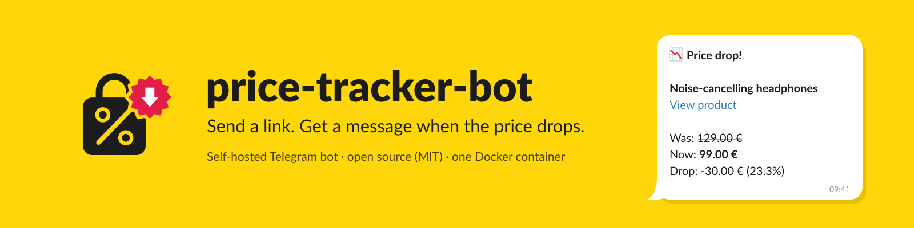
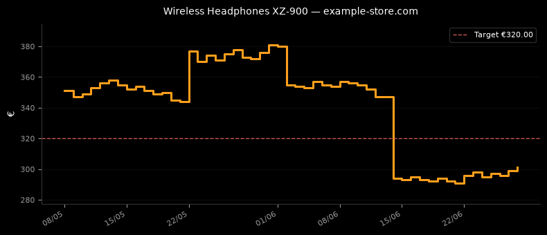

<p align="center">
  
</p>

# price-tracker-bot

[](https://github.com/bernalli/price-tracker-bot/releases)
[](https://github.com/bernalli/price-tracker-bot/actions/workflows/ci.yml)
[](https://github.com/bernalli/price-tracker-bot/actions/workflows/security.yml)
[](LICENSE)

A self-hosted Telegram bot that watches the product links you send and alerts you when their prices drop.

- Paste a product link to track its price on that site.
- Set a price-drop threshold or a target price for each product.
- View price history as a chart with your target line.
- Control notifications with mute, quiet hours, a digest and hourly limits.
- Choose English or Italian, or follow your Telegram app's language.

## Quick start

You need Docker with Compose and a Telegram bot token. No clone is needed.
The published image supports `linux/amd64` and `linux/arm64`.
Release tags are `X.Y.Z`, `X.Y` and `latest`; `latest` follows the newest stable release.
Use an exact `X.Y.Z` tag when you want to choose when to upgrade.

**1. Save this as `docker-compose.yml` in a new directory.**

```yaml
services:
  price-tracker:
    image: ghcr.io/bernalli/price-tracker-bot:latest
    container_name: price-tracker-bot
    restart: unless-stopped
    env_file: .env
    user: "1000:1000"
    read_only: true
    tmpfs:
      - /tmp:size=64m,mode=1777
      - /home/botuser/.cache:size=512m,mode=0755,uid=1000,gid=1000
    volumes:
      - price-tracker-data:/data
      - ./plugins:/app/plugins:ro
    mem_limit: 768m
    mem_reservation: 384m
    cpus: 1.0
    pids_limit: 256
    cap_drop:
      - ALL
    cap_add: []
    security_opt:
      - no-new-privileges:true
    healthcheck:
      test: ["CMD", "python", "-c", "import sqlite3; sqlite3.connect('/data/pricetracker.db').execute('SELECT 1')"]
      interval: 5m
      timeout: 10s
      retries: 3
    logging:
      driver: json-file
      options:
        max-size: "10m"
        max-file: "5"

volumes:
  price-tracker-data:
```

**2. Create your bot with @BotFather in Telegram and copy its token.**
Save a `.env` beside `docker-compose.yml`, replacing both placeholders:

```dotenv
TELEGRAM_BOT_TOKEN=PASTE_BOT_TOKEN_HERE
ALLOWED_USERS=YOUR_NUMERIC_TELEGRAM_ID
```

Use your numeric Telegram user ID for `ALLOWED_USERS`. Every ID listed there
becomes an administrator. To authorize someone without admin privileges, use
`/adduser <telegram_id>` after startup.

If you need to find your ID, temporarily leave `ALLOWED_USERS` empty, start the
bot as below and send `/start`. The access-denied reply includes your ID.
Put it in `.env`, then run `docker compose up -d` again.

**3. Start the bot and send it `/start` in Telegram.**

```bash
mkdir -p plugins
docker compose up -d
```

Paste a product link into the chat to start tracking. To inspect startup logs:

```bash
docker compose logs -f price-tracker
```

## Using the bot

`/start` and `/menu` open Home: **Products**, **Prices**, **Notifications**,
**Data**, **Status & info** and **Settings**. Administrators also see **Admin**.
Telegram's Menu button lists `/menu`, `/list`, `/checkall`, `/status` and `/help`.

Use the buttons or type these commands; `/help` shows the full command list.
Product commands use the ID shown in `/list`.

| Command | What it does |
| --- | --- |
| `/add <url>` | Track a product; pasting its link also works. |
| `/list` | Browse your products and open their cards. |
| `/check <id>` / `/checkall` | Check one product or all your active products now. |
| `/target <id> <price>` | Set a target price; use `0` to clear it. |
| `/threshold <id> <value>` | Set a drop rule, such as `10%` or an absolute amount. |
| `/history <id>` | Show the price-history chart. |
| `/refresh <id> <minutes>` | Set a product's check interval; `0` restores the global interval. |
| `/pause <id>` / `/reactivate <id>` | Pause or resume tracking. |
| `/delete <id>` | Stop tracking and delete the product's history after confirmation. |
| `/export` / `/import` | Export or import products as CSV. |
| `/prefs` | Show your notification preferences. |
| `/cancel` | Cancel the current guided action. |

Administrators can change the global interval with `/setinterval <minutes>`.
Existing Italian aliases, such as `/lista` for `/list`, also work.

In **Settings**, adjust mute, digest, quiet hours, timezone and notification
throttle. **Settings → Language** offers Automatic, English and Italiano.
Automatic uses your Telegram language, then the server's `LOCALE`, then English.
See [notification preferences](docs/notifications.md) and [translations](docs/i18n.md).

<p align="center">
  
  <br>
  <em>The <code>/history</code> command: price history with your target line, rendered by the bot.</em>
</p>

## Configuration

The Compose setup loads environment variables from `.env`.
These are the essentials; see [operations](docs/operations.md#environment-variables)
and the [configuration template](.env.example) for more settings.

| Variable | Default | Purpose |
| --- | --- | --- |
| `TELEGRAM_BOT_TOKEN` | Required | Token from @BotFather. |
| `ALLOWED_USERS` | Empty | Comma-separated administrator IDs; set yours for first use. |
| `DATABASE_PATH` | `/data/pricetracker.db` | SQLite database; keep this path with the supplied Compose healthcheck. |
| `CHECK_INTERVAL_MINUTES` | `360` | Global check interval in minutes, unless overridden in the bot. |
| `LOCALE` | `en` | Fallback language (`en` or `it`). |
| `LOG_LEVEL` | `INFO` | Logging verbosity. |

## Supported sites

The bot includes 17 built-in scrapers:

- Site scrapers: Amazon, eBay, Walmart, Target, BestBuy, Etsy, Newegg, Wayfair,
  MediaMarkt, Otto, Zalando, Apple Store, Google Store and AliExpress.
- Shopify scraper for Shopify product pages.
- Generic scraper: tries JSON-LD, microdata, OpenGraph and RDFa, then other
  page-extraction strategies. Success depends on the page's available data.
- Playwright fallback: retained in the registry, but browser rendering is disabled.

Each link is tracked on its own site. Browser-only pages may not yield a price.
See [scrapers](docs/scrapers.md) and the [current fetch restrictions](docs/operations.md#outbound-destination-policy).
Add a custom scraper as a Python file in `plugins/`; the Compose setup mounts
that directory read-only. See the [plugin contract](docs/plugins.md#contract).

## Self-hosting notes

**Hardening.** The Compose setup runs as a non-root user with a read-only root
filesystem, drops all capabilities and prevents privilege escalation. It includes
memory, CPU and process limits, a database healthcheck and log rotation.
See [deployment details](docs/operations.md#hardened-deployment).

**Backups.** The `price-tracker-data` volume stores the SQLite database. Take a
consistent database backup before upgrades: use SQLite's backup API, or stop the
bot before copying the database. See [backup and restore](docs/operations.md#backup--restore).
The Compose service name for stop/start/logs commands is `price-tracker`.

**Upgrades.** For the image setup above, back up the database, update the image
tag if pinned, then run:

```bash
docker compose pull
docker compose up -d
```

Schema migrations run automatically at startup. See [upgrade and rollback](docs/operations.md#upgrade-procedure)
and the [changelog](CHANGELOG.md).

**Observability.** Prometheus metrics and structured JSON logs are available.
The exporter binds to container loopback by default; the Compose setup publishes
no ports. See [observability](docs/observability.md) for metrics and the Grafana dashboard,
and [architecture](docs/architecture.md) for scheduler and scraper-health internals.

## Build from source

To build with the repository's Compose file:

```bash
git clone https://github.com/bernalli/price-tracker-bot.git
cd price-tracker-bot
cp .env.example .env
# Edit .env: set TELEGRAM_BOT_TOKEN and ALLOWED_USERS.
docker compose up -d --build
```

## Stability

The [1.x stability promise](CHANGELOG.md#100---2026-09-02) covers the SQLite schema
and command surface: migrations from any 1.x to a later 1.x apply forward without
data loss, and commands present in 1.0 keep their names and arguments throughout 1.x.
Removing a command or breaking the schema requires 2.0.

The internal Python API, notification wording and scraper set are outside this
promise. Sites change their markup, and scrapers change with them.

## Contributing, security and license

See [Contributing](CONTRIBUTING.md) for development and contribution guidelines,
[Security](SECURITY.md) to report a vulnerability, and [LICENSE](LICENSE) for the MIT license.
